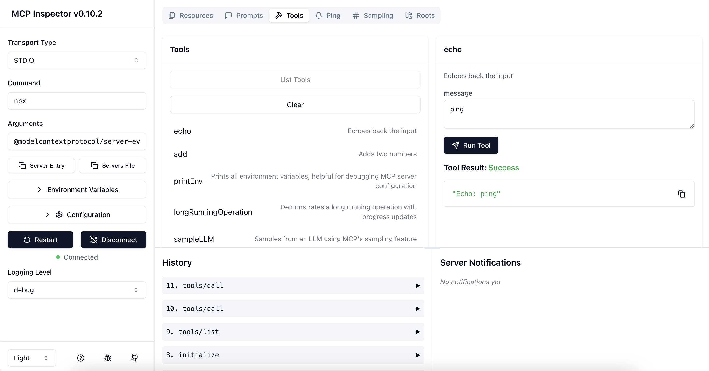

# MCP Inspector

The MCP inspector is a developer tool for testing and debugging MCP servers.



## Running the Inspector

### From an MCP server repository

To inspect an MCP server implementation, there's no need to clone this repo. Instead, use `npx`. For example, if your server is built at `build/index.js`:

```bash
npx @modelcontextprotocol/inspector node build/index.js
```

You can pass both arguments and environment variables to your MCP server. Arguments are passed directly to your server, while environment variables can be set using the `-e` flag:

```bash
# Pass arguments only
npx @modelcontextprotocol/inspector build/index.js arg1 arg2

# Pass environment variables only
npx @modelcontextprotocol/inspector -e KEY=value -e KEY2=$VALUE2 node build/index.js

# Pass both environment variables and arguments
npx @modelcontextprotocol/inspector -e KEY=value -e KEY2=$VALUE2 node build/index.js arg1 arg2

# Use -- to separate inspector flags from server arguments
npx @modelcontextprotocol/inspector -e KEY=$VALUE -- node build/index.js -e server-flag
```

The inspector runs both an MCP Inspector (MCPI) client UI (default port 6274) and an MCP Proxy (MCPP) server (default port 6277). Open the MCPI client UI in your browser to use the inspector. (These ports are derived from the T9 dialpad mapping of MCPI and MCPP respectively, as a mnemonic). You can customize the ports if needed:

```bash
CLIENT_PORT=8080 SERVER_PORT=9000 npx @modelcontextprotocol/inspector node build/index.js
```

For more details on ways to use the inspector, see the [Inspector section of the MCP docs site](https://modelcontextprotocol.io/docs/tools/inspector). For help with debugging, see the [Debugging guide](https://modelcontextprotocol.io/docs/tools/debugging).

### Authentication

The inspector supports bearer token authentication for SSE connections. Enter your token in the UI when connecting to an MCP server, and it will be sent in the Authorization header.

### Security Considerations

The MCP Inspector includes a proxy server that can run and communicate with local MCP processes. The proxy server should not be exposed to untrusted networks as it has permissions to spawn local processes and can connect to any specified MCP server.

### Configuration

The MCP Inspector supports the following configuration settings. To change them click on the `Configuration` button in the MCP Inspector UI :

| Name                       | Purpose                                                                                   | Default Value |
| -------------------------- | ----------------------------------------------------------------------------------------- | ------------- |
| MCP_SERVER_REQUEST_TIMEOUT | Maximum time in milliseconds to wait for a response from the MCP server before timing out | 10000         |

### From this repository

If you're working on the inspector itself:

Development mode:

```bash
npm run dev
```

> **Note for Windows users:**  
> On Windows, use the following command instead:
>
> ```bash
> npm run dev:windows
> ```

Production mode:

```bash
npm run build
npm start
```

## License

This project is licensed under the MIT License—see the [LICENSE](LICENSE) file for details.
